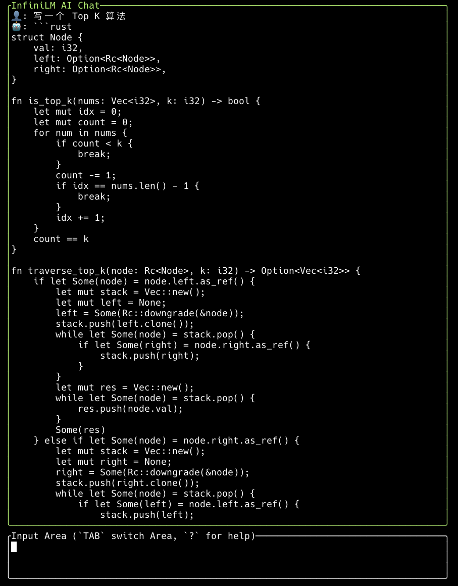

# InfiniTUI: InfiniLM 的终端 UI 客户端

- 
- 

操作模式类似于 Vim，灵感借鉴于 [tenere](https://github.com/pythops/tenere) 。
## 支持平台

- [x] MacOS
- [x] Linux
- [] Windows


## V0.1.0 功能列表

- 与大模型对话
- 对话历史
- 保存对话记录到指定目录文件
- 打开指定目录并展示 markdown 文件
- 复制指定文件内容和目录结构作为 prompt 到剪切板

## 支持模型

- InfiniLM
- Ollama
- OpenAI GPT
- ChatGLM（智谱清言）


## 使用 InfiniLM

### 启动 InfiniLM

```
> cd /path/to/InfiniLM
> cargo service  --model model/your_cast_model_path/ --port 3000 --top-k 100  --top-p 0.9 --temperature 0.9 --log info
```

### 启动 infini TUI Client

1. 配置文件

配置文件使用 TOML 配置文件进行配置。文件默认位置为：

- Linux：`$HOME/.config/infini/` 或 `$XDG_CONFIG_HOME/infini/`
- Mac：`$HOME/Library/Application Support/infini/`

**你也可以自定义配置文件目录**：

```
export CONFIG_DIR=/path/to/infiniinfini_config_dir/
```

**需要配置的文件如下**：

- `config.toml`，指定使用的模型等信息
- `prompts.toml`，设置默认的 prompts 信息

[config.template.toml](./config.template.toml) 示例：

```rust
archive_file_name = "/Users/username/infini.archive.md"
file_explorer_path = "/Users/username/Work/Projects/infini/files/"
llm = "infinilm"

language = "zh-CN"  # 或 "en"

[infinilm]
url = "http://localhost:3000/infer"
```

[prompt.template.toml](./prompt.template.toml) 示例：

```rust
[[messages]]
role = "system"
content = """
你现在是一个 Rust 语言专家，为用户解答任何 Rust 相关问题，并输出安全和健壮的 Rust 代码：

确保你输出的 Rust 代码中不要加任何转义符号！

转换完成之后请按指定 json 格式输出。
"""

```

2. 编译运行

在项目根目录：

```
> cargo run
```

或用 [Just](https://github.com/casey/just) 部署（或参考 : [Justfile](./Justfile) 文件，使用对应 cargo 命令）

```
> just deploy
> infini
```

3. 界面多语言支持

目前支持 中文 和 英文 两种语言：

可以在编译运行时指定 `--lang` 参数指定语言

```
> cargo run -- --lang en
```

也可以在 `config.toml` 中配置 `language` 语言，默认为 中文（`zh-CN`）

## 基本操作

- `tab` 键可以切换焦点
- 焦点在 prompt 区域，按 `i` 键可以输入，按 `esc` + `enter` 发送消息
- 焦点在 chat 区域，按 `j` 或 `k` 可以上下滚动
- `?` 弹出帮助界面
- `ctrl + f` 弹出指定的文件目录，`->` 可进入目录，`tab` 可切换页面， `j`或`k` 上下滚动内容
- `ctrl + p` 可以复制选定文件内容及其目录结构作为 Prompt 到剪切板，随后可粘贴到 prompt 输入框

**特定用法**

可以用于 infiniLM 代码阅读和开发调试 ：

- 可以把 infinilm 的源码放到指定目录，设置 file_explorer_path
- 通过 ctrl+f 和 ctrl + p ，直接把代码文件和指定目录结构生成为一个 prompt，自动复制到剪切板，然后可以粘贴进 prompt 输入框让大模型解读相关代码


### 键绑定

InfiniTUI 支持自定义键绑定。
您可以通过更新 config 配置文件中的`[key_bindings]`部分来修改一些默认键绑定。
这是一个包含默认键绑定的示例

```toml
[key_bindings]
show_help = '?'
show_history = 'h'
new_chat = 'n'
save_chat = 's'
```

ℹ️ 注意

> 为避免与vim键绑定重叠，您需要使用`ctrl` + `键`，除了帮助`?`外。

## ⌨️ 键绑定介绍

### 全局

这些是无论焦点在哪个块上都适用的默认键绑定。

`ctrl + n`：开始新聊天并将上一个保存在历史中。

`ctrl + s`：保存当前聊天或聊天历史（首先应该可见历史弹出窗口）到指定目录下的`
infini.archive.md`文件。

`Tab`：切换焦点。

`j`或`向下箭头键`：向下滚动

`k`或`向上箭头键`：向上滚动

`ctrl + h`：显示聊天历史。按`Esc`关闭它。

`ctrl + t`：停止流响应

`q`或`ctrl + c`：退出应用

`?`：显示帮助弹出窗口。按`Esc`关闭它

### 提示符

有像vim一样的3种模式：`Normal`、`Visual`和`Insert`。

#### 插入模式

`Esc`：切换回正常模式。

`Enter`：创建新行。

`Backspace`：删除前一个字符。

#### 正常模式

`Enter`：提交提示

<br>

`h或Left`：向后移动光标一字符。

`j或Down`：向下移动光标。

`k或Up`：向上移动光标。

`l或Right`：向前移动光标一字符。

`w`：向右移动光标一个单词。

`b`：向后移动光标一个单词。

`0`：移动光标到行首。

`$`：移动光标到行尾。

`G`：移动到底部。

`gg`：移动到顶部。

<br>

`a`：在光标后插入。

`A`：在行尾插入。

`i`：在光标前插入。

`I`：在行首插入。

`o`：在当前行下面添加新行。

`O`：在当前行上面添加新行。

<br>

`x`：删除光标下的一个字符。

`dd`：剪切当前行

`D`：删除当前行并

`dw`：删除光标旁的单词。

`db`：删除光标左侧的单词。

`d0`：从光标删除到行首。

`d$`：从光标删除到行尾。

<br>

`C`：更改到行尾。

`cc`：更改当前行。

`c0`：从光标更改到行首。

`c$`：从光标更改到行尾。

`cw`：更改下一个单词。

`cb`：更改光标左侧的单词。

<br>

`u`：撤销

`p`：粘贴

#### 视觉模式

`v`：切换到视觉模式。

`y`：复制选中的文本

<br>

## ⚖️ 许可证

- GPLv3
- MIT
